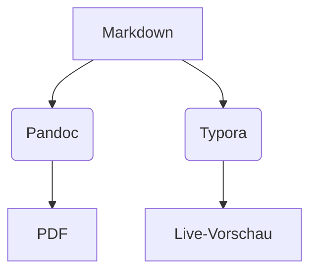

# Überschrift 1: **Fette** und *kursiv* Text

Ein einfacher Absatz. Inline-Code: `print("Hallo")`. Inline-Formel: \(E=mc^2\).

## Überschrift 2: Listen und Zitate

**Aufzählungsliste:**
- Punkt 1
- Punkt 2 mit Unterpunkt (Komma: A, B)
- Punkt 3

**Nummerierte Liste:**
1. Erstes
2. Zweites
3. Drittes

> Dies ist ein Zitat.  
> Mehrzeilig mit Leerzeile. [@doe2024]

**Fußnote[^1].**

## Tabellen

| Tool     | Zweck     | Plattform |
|----------|-----------|-----------|
| Pandoc  | PDF/HTML | CLI      |
| Typora  | Editor   | Desktop  |
| VS Code | Erweiterungen | Alle   |

## Mathematische Formeln

**Inline:** \(a^2 + b^2 = c^2\).

**Block:**
\[
\int_0^\infty e^{-x^2} \, dx = \frac{\sqrt{\pi}}{2}
\]

**Matrix:**
\[
\begin{pmatrix}
1 & 2 \\
3 & 4
\end{pmatrix}
\]

## Code-Blöcke

```python
def quadratisches_gleichung(a, b, c):
    return (-b ± sqrt(b**2 - 4*a*c)) / (2*a)
```

**Shell:**
```bash
pandoc datei.md -o datei.pdf --citeproc
```

## Diagramme (Mermaid)



## Links und Bilder

Lesen Sie mehr auf [Pandoc-Docs](https://pandoc.org).

.

[^1]: Erste Fußnote mit Erklärung.

---
## Literatur

Siehe [@Max2024] für Details.

